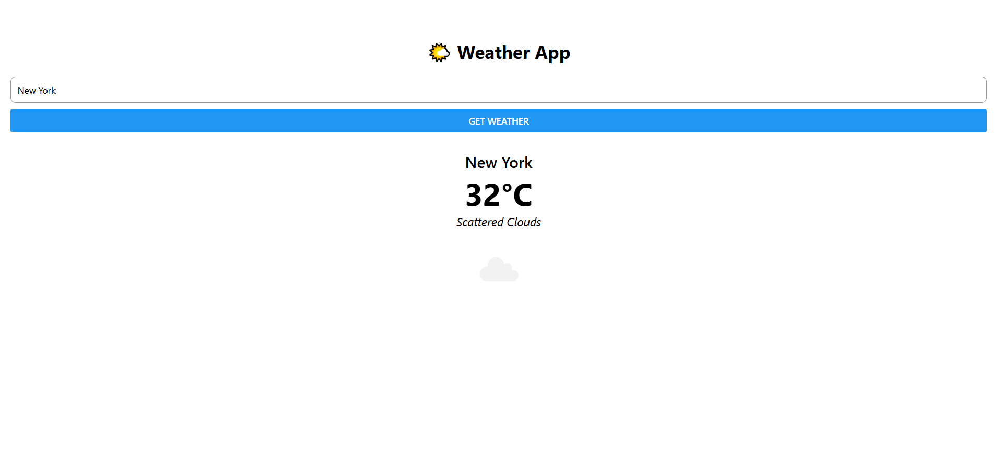

# React Native Weather App ☁️🌤️🌧️

This is a simple React Native weather app built with **Expo**. It uses the **OpenWeatherMap API** to fetch current weather data based on the city you enter.

### 🚀 Features

- Search by city name
- Displays temperature, weather condition, and icon
- Built with React Native + TypeScript using Expo
- Fully functional on mobile and web

### 🔧 Tech Stack

- React Native
- Expo
- TypeScript
- OpenWeatherMap API

### 📸 Demo Screenshot

<<<<<<< HEAD

=======

>>>>>>> 049987117d6e58e96110720d934644b2d60b10e2

### 🔑 How to Run Locally

```bash
git clone https://github.com/YOUR_USERNAME/react-native-weather-app.git
cd react-native-weather-app
npm install
npx expo start
